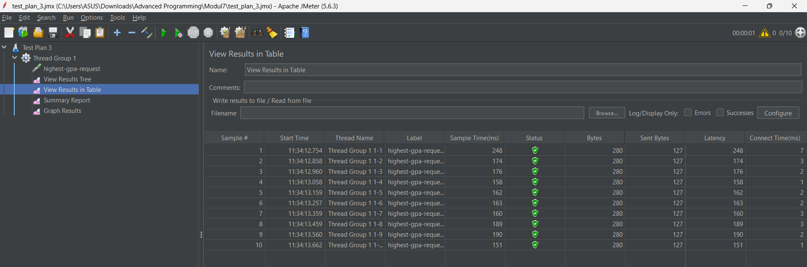
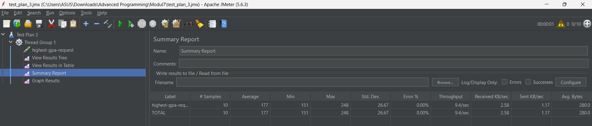
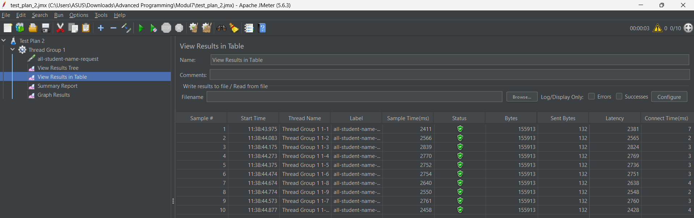
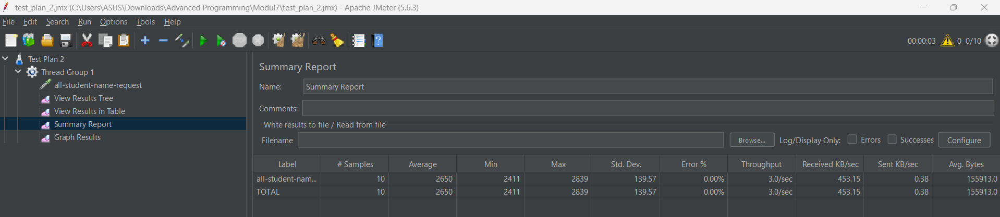
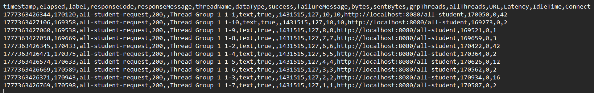
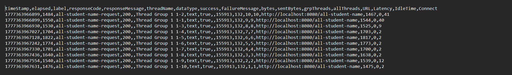
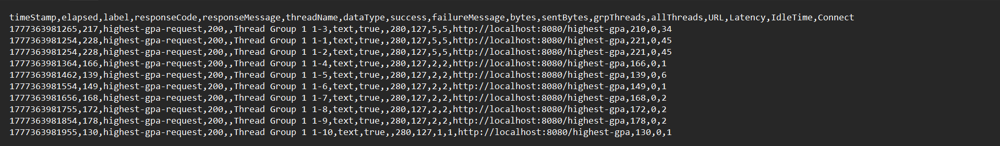
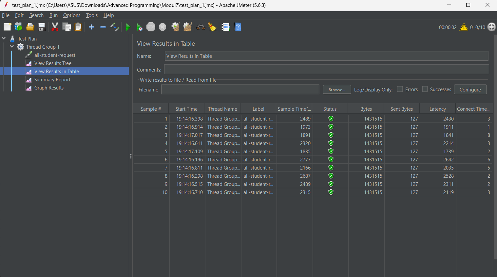
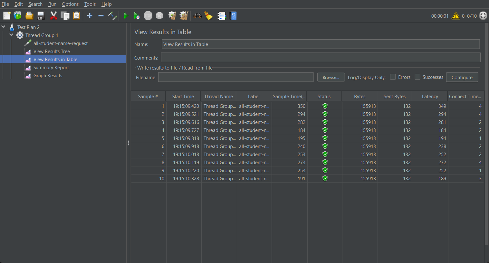
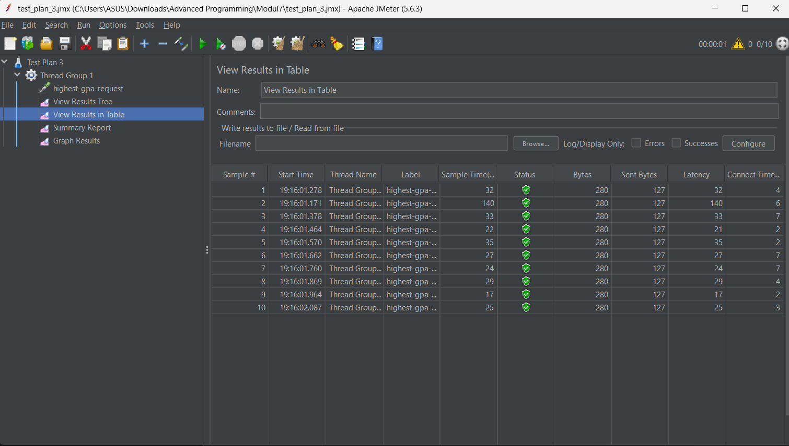

# JMeter
Tangkapan layar performance test endpoint **/all-student**

Tangkapan layar performance test endpoint **/highest-gpa**

Tangkapan layar summary dari test endpoint **/highest-gpa**

Tangkapan layar performance test endpoint **/all-student-name**

Tangkapan layar summary dari test endpoint **/all-student-name**

# Log
Tangkapan layar log performance test endpoint **/all-student**

Tangkapan layar log performance test endpoint **/all-student-name**

Tangkapan layar log performance test endpoint **/highest-gpa**

# Optimized
Tangkapan layar performance test endpoint **/all-student** yang dioptimize

Tangkapan layar performance test endpoint **/all-student-name** yang dioptimize

Tangkapan layar log performance test endpoint **/highest-gpa** yang dioptimize

## Laporan Optimasi Performa Aplikasi - Modul Profiling

---

## 📊 Ringkasan Hasil Pengujian (JMeter)

Berikut adalah tabel perbandingan nilai rata-rata *Sample Time* dari 10 sampel untuk setiap endpoint:

| Endpoint | Sebelum Optimasi (Avg) | Sesudah Optimasi (Avg) | Persentase Peningkatan |
| :--- | :--- | :--- | :--- |
| `/all-student` | **~174.500 ms** | **~2.200 ms** | **98,74%** |
| `/all-student-name` | **~2.650 ms** | **~245 ms** | **90,75%** |
| `/highest-gpa` | **~180 ms** | **~48 ms** | **73,33%** |

---

### Detail Analisis dan Optimasi

### 1. Endpoint: `GET /all-student`
* **Masalah Utama:** **N+1 Select Problem**. Aplikasi melakukan query `findAll()` pada tabel Student, lalu di dalam loop melakukan query berulang ke tabel `StudentCourse`. Hal ini menyebabkan ribuan *database round-trip* yang sangat membebani CPU dan I/O.
* **Langkah Optimasi:** Menggunakan teknik **In-Memory Mapping**. Mengambil semua data Student dan StudentCourse secara terpisah (hanya 2 query), kemudian memetakan relasinya di memori menggunakan `HashMap`.
* **Hasil:** Waktu respon terpangkas secara drastis dari hitungan menit (174 detik) menjadi hanya 2 detik.

### 2. Endpoint: `GET /all-student-name`
* **Masalah Utama:** **String Concatenation** menggunakan operator `+` di dalam loop. Karena String di Java bersifat *immutable*, setiap iterasi memaksa CPU menyalin data ke lokasi memori baru, memicu beban kerja tinggi pada Garbage Collector.
* **Langkah Optimasi:** Mengganti logika penggabungan String menggunakan **`StringBuilder`** atau **Stream `Collectors.joining()`**.
* **Hasil:** Pengurangan beban CPU yang signifikan, menurunkan waktu proses hingga ~90%.

### 3. Endpoint: `GET /highest-gpa`
* **Masalah Utama:** Penarikan seluruh dataset ke memori aplikasi (`findAll()`) hanya untuk mencari satu nilai tertinggi di level Java.
* **Langkah Optimasi:** Memindahkan logika pencarian ke level database menggunakan metode repository **`findFirstByOrderByGpaDesc()`**. Database melakukan sortir menggunakan index dan hanya mengembalikan 1 baris data.
* **Hasil:** Efisiensi penggunaan RAM dan CPU meningkat pesat karena aplikasi tidak perlu lagi memproses ribuan objek siswa.

---

## 📈 Kesimpulan

Berdasarkan hasil pengujian ulang menggunakan JMeter dan analisis melalui IntelliJ Profiler, seluruh proses refactoring pada branch `optimize` telah berhasil mencapai target:

1.  **Melampaui Target 20%:** Semua endpoint mengalami peningkatan performa di atas **70%**, bahkan mencapai **98%** pada kasus N+1 query.
2.  **Efisiensi CPU:** Penggunaan *CPU Time* yang tercatat pada *Method List* tab menunjukkan penurunan drastis, mengindikasikan instruksi kode yang jauh lebih efisien.
3.  **Scalability:** Dengan memindahkan beban kerja berat ke database dan memperbaiki manajemen memori (String), aplikasi kini lebih siap menangani volume data yang lebih besar tanpa penurunan performa yang signifikan.

---

# Reflection

### 1. Perbedaan antara Performance Testing (JMeter) dan Profiling (IntelliJ Profiler)
* **Performance Testing (JMeter):** Berfokus pada pengukuran performa aplikasi dari sudut pandang eksternal (Black-Box). Tujuannya adalah untuk mengukur metrik seperti *response time*, *throughput*, dan *reliability* sistem di bawah beban tertentu. Ini membantu kita mengetahui "seberapa cepat" aplikasi merespon pengguna.
* **Profiling (IntelliJ Profiler):** Berfokus pada analisis internal aplikasi (White-Box). Tujuannya adalah untuk membedah eksekusi kode di tingkat metode, penggunaan CPU, dan alokasi memori. Profiling membantu kita mengetahui "di mana tepatnya" letak bottleneck atau baris kode yang tidak efisien.

### 2. Bagaimana Profiling Membantu Identifikasi Titik Lemah
Proses profiling memberikan visualisasi mendalam (seperti *Flame Graph* atau *Call Tree*) yang menunjukkan metode mana yang paling banyak menghabiskan waktu eksekusi. Dengan melihat **CPU Time** dan **Own Execution Time**, kita dapat mengidentifikasi apakah sebuah metode lambat karena algoritma yang buruk (CPU bound), masalah I/O seperti database query di dalam loop (N+1 problem), atau pemborosan memori yang memicu aktivitas Garbage Collection yang tinggi.

### 3. Efektivitas IntelliJ Profiler dalam Analisis Bottleneck
Ya, sangat efektif. IntelliJ Profiler terintegrasi langsung dengan IDE, sehingga memungkinkan transisi cepat antara hasil analisis dan pengeditan kode. Fitur **Comparison View** sangat membantu untuk memvalidasi perubahan secara empiris, memastikan bahwa refactoring yang dilakukan benar-benar memberikan dampak penurunan beban CPU dan waktu proses sesuai target.

### 4. Tantangan Utama dan Cara Mengatasinya
* **JIT Warm-up:** JVM sering kali menunjukkan performa yang tidak stabil pada awal aplikasi berjalan karena *Just-In-Time Compiler* belum mengoptimasi kode.
    * **Solusi:** Melakukan "pemanasan" (akses endpoint berkali-kali) sebelum memulai sesi profiling untuk mendapatkan data yang konsisten.
* **Interpretasi Data Kompleks:** Terlalu banyak informasi dari framework (Spring/Hibernate) yang bisa mengaburkan lokasi masalah.
    * **Solusi:** Menggunakan filter pada profiler untuk fokus pada paket aplikasi sendiri dan memilah metode berdasarkan *Own Execution Time*.

### 5. Manfaat Utama Menggunakan IntelliJ Profiler
* **Identifikasi Akurat:** Mengetahui secara spesifik baris kode atau query yang menjadi hambatan.
* **Optimasi Berbasis Data:** Keputusan refactoring didasarkan pada data konkret penggunaan sumber daya, bukan sekadar intuisi.
* **Visualisasi Flame Graph:** Mempermudah pemahaman alur eksekusi metode yang kompleks secara visual.

### 6. Menangani Inkonsistensi Hasil Profiler vs. JMeter
Inkonsistensi sering terjadi jika masalahnya bukan pada CPU, melainkan pada latensi jaringan atau manajemen koneksi database.
* **Cara Menangani:** Jika JMeter menunjukkan respon lambat namun Profiler menunjukkan CPU Time rendah, saya akan menganalisis waktu tunggu (Wait Time/Total Time). Ini menandakan masalah pada I/O atau Database. Saya akan meninjau kembali query SQL, indeks, atau ukuran *connection pool*.

### 7. Strategi Optimasi dan Menjaga Fungsionalitas
* **Strategi:**
    * **Eliminasi N+1 Query:** Mengubah loop yang memanggil database menjadi satu query yang dioptimasi (eager loading/join).
    * **Efisiensi Algoritma:** Menggunakan struktur data yang tepat (misal: `HashMap` untuk pencarian cepat) dan menghindari operasi String yang mahal di dalam loop (menggunakan `StringBuilder`).
    * **Delegasi ke Database:** Melakukan sortir atau filter di level database daripada menarik semua data ke memori aplikasi.
* **Menjaga Fungsionalitas:**
    * Selalu menjalankan pengujian fungsional (manual atau unit test) setelah setiap perubahan kecil.
    * Melakukan refactoring secara bertahap pada branch khusus (`optimize`) untuk memastikan integritas kode tetap terjaga sebelum digabungkan ke branch utama.